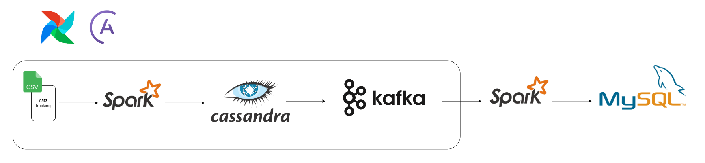
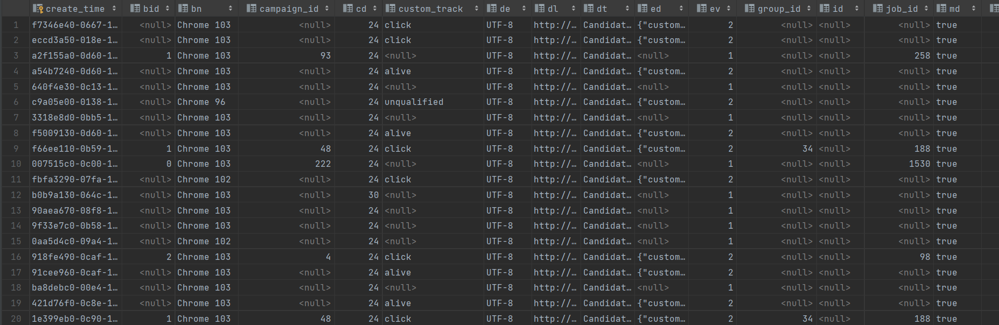
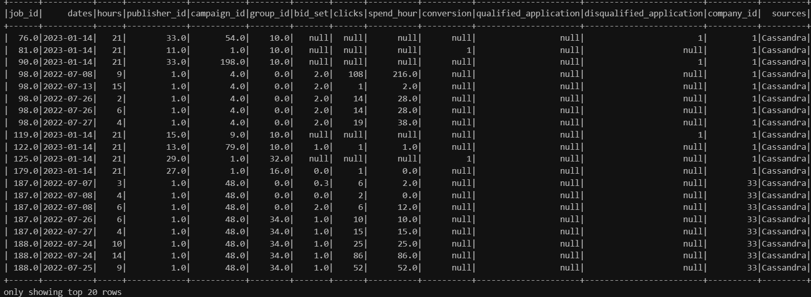

# Streaming data processing system

### Objective

This project focuses on building a data processing and analysis system from log data from users of a recruitment website. The main goal is to store, process, analyze that log data and decide the next step of the business development. Raw data is stored in Cassandra (Data Lake), PySpark for transforming the data from Cassandra then put the processed data to MySQL, MySQL for data warehousing. Using Docker to deploy the project easily.

- Tech stack: PySpark, Docker, Cassandra, MySQL, Python, Apache Airflow, Apache Kafka

### Architecture



### Raw data



### Process

1. Use PySpark read file data tracking.csv and import to Cassandra

2. Use Python read data in Cassandra, process and import to Kafka

- The above steps are managed by Apache Airflow

4. Use PySpark readstream data in Apache Kafka and process

- Filter actions with analytical value in column ["custom_track"] including: clicks, conversion, qualified, unqualified.
- Remove null values, replace with 0 to be able to calculate.
- Join with "job" table in MySQL to get "company_id" column

5. Save data to MySQL

### Clean data



### Setup

##### Python

- [Install Python](https://www.anaconda.com/download)

##### Spark

- [Install Spark](https://spark.apache.org/downloads.html)

##### Hadoop

- [Install Haoop](https://hadoop.apache.org/releases.html)

##### Java

- [Install Java](https://www.oracle.com/java/technologies/javase/jdk17-archive-downloads.html)

##### Docker

- [Install Docker](https://docs.docker.com/desktop/install/windows-install/)

##### Astro Cli

- [Install Astro Cli](https://docs.astronomer.io/astro/cli/install-cli)

##### Getting Started

1. Clone the repository:

   ```bash
   git clone https://github.com/ddooxhuy09/Streaming_data_processing_system.git
   ```

2. Project creation:

   ```bash
   astro dev init
   ```

3. Start project:
   ```bash
   astro dev start
   ```
